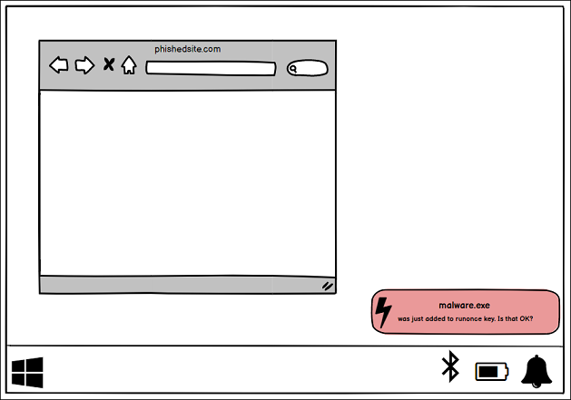
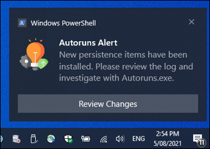
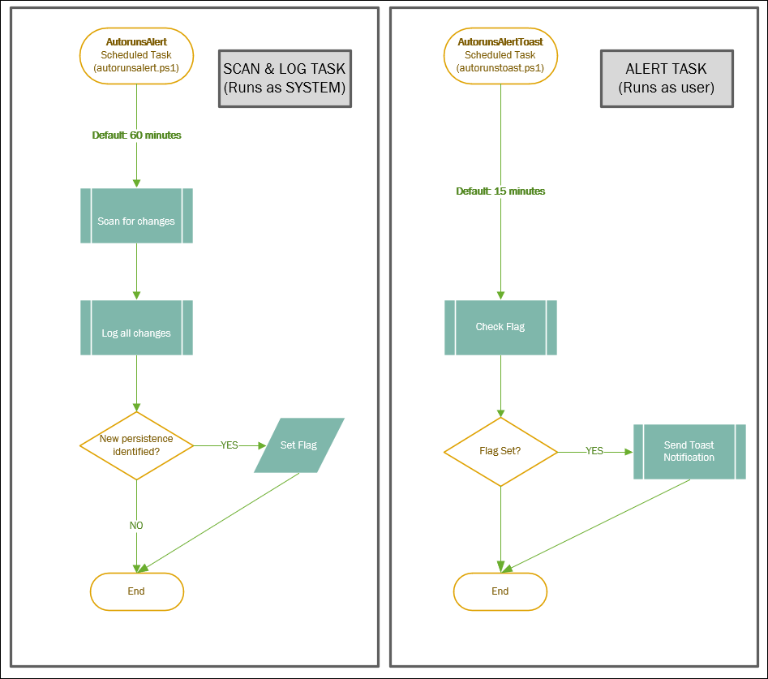

# AutorunsAlerts

Simple toast notifications for persistence changes on Windows via autorunssc.exe. 

### Installation:

1. Clone this repository. 
2. From an **administrative** PowerShell prompt run `.\install.ps1`

```
PS C:\Users\chad\AutorunsAlerts> .\install.ps1
[*] Configuring Program Files
[*] Configuring Autorunsc64.exe
[*] Installing BurntToast PowerShell module
[*] Copying scripts to Program Files directory
[*] Configuring Scheduled Task for Autoruns Worker
[*] Configuring Scheduled Task for Autoruns Toast Alerts
[*] Setup is complete
```

### Uninstall:

1. From an **administrative** PowerShell prompt run `.\uninstall.ps1`

```
PS C:\Users\chad\AutorunsAlerts> .\uninstall.ps1
[*] Removing scheduled tasks
[*] Removing Program Directory
[*] Removing Registry Key
[*] Uninstall complete.
```

## More Information:

### If you're not familiar with Autoruns:

Autoruns is a an excellent tool developed by Sysinternals (Mark Russinovich) which allows you to view all of the locations in Windows where applications can insert themselves to launch at boot or when certain applications are opened. Malware often takes advantages of these locations to ensure that it runs whenever your computer boots up.

More on Autoruns here: https://technet.microsoft.com/en-us/sysinternals/bb963902.aspx

### This Project

This project build's on the work done by Dane Stuckey, Chris Long and Andy Robbins a few years ago on the [AutorunsToWinEventLog](https://github.com/palantir/windows-event-forwarding/tree/master/AutorunsToWinEventLog) project. AutorunsToWinEventLog sends all autoruns information to the Windows event log on a schedule. This information can then be forwarded to central logging servers via WEF.

The aim of the **AutorunsAlerts** hackweek project is a little different. For this project we'd like to bubble up any change information to the user right away. If something is installed which grants itself permission to start automatically when something happens (boot up, log on, application start etc.) we'd like the user to know about it whether it is malicious or not. This allows the user to investigate using the Sysinternals suite and make their own decision. 

Something like this:



Example Toast:



### How does it work?

There are two scheduled tasks: 
- AutorunsAlert: runs as system every 60 minutes; scans for changes; logs changes, and sets a flag if something is found that the user needs to know about. 
- AutorunsAlertToast: runs in the user context every 15 minutes; checks for the notification flag; sends toast alerts linking to detailed logs for investigation.



## Program Files:

- `autorunsalert.ps1` is the main script. It is called via a scheduled task and leverages autorunsc.exe to check the current state of the system. It compares this state to the previous state. If differences are found that information is logged in `audit.log` in the program files directory. `audit.log` includes ALL changes to autoruns configuration, not just new items. 
- `autorunstoast.ps1` is the alerting script. It exists to separate the toast alert so that it can be displayed in the current user session, rather than the system session used by the main `autorunsalert.ps1` to do the scanning. The toasts created by `autorunstoast.ps1` link directly to `audit.log` to assist with investigation. It leverages [Joshua Kings "BurntToast" library](https://github.com/Windos/BurntToast).
- `configuration.json` contains the variables used by both scripts. 
- `install.ps1` and `uninstall.ps1` do what you might expect. 
- `state.json` is a recording of the last run of `autorunsalert.ps1`. It's what the script will compare the fresh information against. 

Example `audit.log`:
```
2021/08/06 08:01:47 INFO Removed persistence item. (Was in the previous autoruns scan, but no longer exists):
{
    "Time":  "",
    "Entry Location":  "HKCU\\SOFTWARE\\Microsoft\\Windows\\CurrentVersion\\Run",
    "Entry":  "AdobeThing",
    "Enabled":  "enabled",
    "Category":  "Logon",
    "Profile":  "JMPESP\\cduffey",
    "Description":  "",
    "Signer":  "",
    "Company":  "",
    "Image Path":  "c:\\adobething\adobething.exe",
    "Version":  "1.0",
    "Launch String":  "adobething",
    "SideIndicator":  "\u003c="
}
2021/08/06 08:08:55 WARN NEW AUTORUN: 
{
    "Time":  "",
    "Entry Location":  "HKCU\\SOFTWARE\\Microsoft\\Windows\\CurrentVersion\\Run",
    "Entry":  "MalwareNumber5",
    "Enabled":  "enabled",
    "Category":  "Logon",
    "Profile":  "JMPESP\\cduffey",
    "Description":  "Very catchy malware",
    "Signer":  "BadBadManInHoodie",
    "Company":  "BadBadPlace",
    "Image Path":  "c:\\temp\\malware.exe",
    "Version":  "0.1",
    "Launch String":  "malware.exe",
    "SideIndicator":  "=\u003e"
}
```

### Questions:

**Why PowerShell?...**   
 - It didn't feel right using autorunsc.exe via a compiled binary; Mark R's program is doing all the real work here. 
 - Security enthusiast skepticism in downloading a compiled release. 
 - Often too much effort to compile from source for folk that just want to try it out 
 - Hackweek timeframe. 
 - Most importantly, **this is just a POC demonstrating a feature I'd love natively in the Microsoft Sysinternals suite**.  

**Why not use a Windows service v scheduled task?** 
 -  Scheduled task is easy, lightweight, has simple PowerShell support. 
 -  There are also issues with session 0 v session 1 issues when trying to add GUI interaction from a service.
 -  Same answer though, POC. If this was in sysinternals magic it would most likely be a service.  

**Will anyone care?**
 - Maybe, possibly not. But i like the idea of a configurable, lightweight program running in the background to tip me off to things I'd like to know about on my machines. I'd like to be able to define those things. This is a step in that direction. I even like to know when the corporate overloads push a new thing to my machine in the background.   

**JSON "database"? Gross**.  
 - Yeah, ack. This approach is lightweight and does the job for the POC. The autoruns.exe GUI should be the next step in any investigation, not this tool. The aim here is to provide alerts so that you can go learn more about what was installed on your machine with or without your knowledge.  

### Attribution:

1. Microsoft Autoruns: Mark Russinovich at https://docs.microsoft.com/en-us/sysinternals/downloads/autoruns 
2. BurntToast: Joshua King at https://github.com/Windos/BurntToast
3. AutorunsToWinEventLog: Dane Stuckey, Chris Long, Andy Robbins at https://github.com/palantir/windows-event-forwarding/tree/master/AutorunsToWinEventLog
